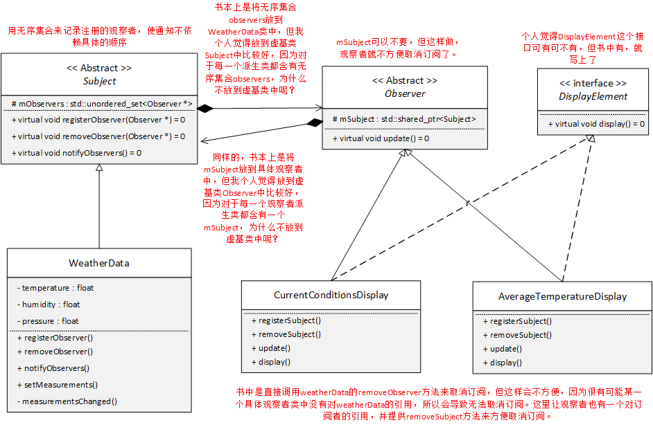
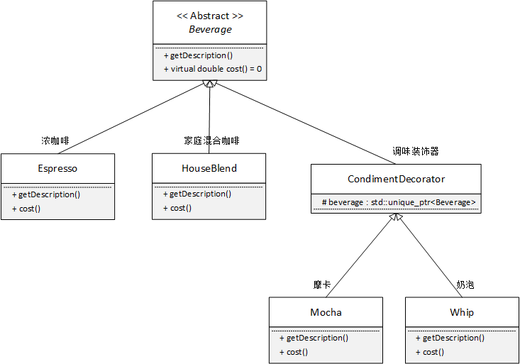

# 设计模式

23种经典设计模式共分为3种类型，分别是创建型、结构型和行为型。

创建型设计模式包括：单例模式、工厂模式、建造者模式、原型模式。它主要解决对象的创建问题，封装复杂的创建过程，解耦对象的创建代码和使用代码。

结构型模式主要总结了一些类或对象组合在一起的经典结构，这些经典的结构可以解决特定应用场景的问题。结构型模式包括：代理模式、桥接模式、装饰器模式、适配器模式、门面模式、组合模式、享元模式。

我们知道，创建型设计模式主要解决“对象的创建”问题，结构型设计模式主要解决“类或对象的组合”问题，那行为型设计模式主要解决的就是“类或对象之间的交互”问题。行为型模式比较多，有11种，它们分别是：观察者模式、模板模式、策略模式、职责链模式、迭代器模式、状态模式、访问者模式、备忘录模式、命令模式、解释器模式、中介模式。

## 策略模式

## 观察者模式

## 装饰器模式

## 设计模式的几个原则

| 设计原则     | 一句话归纳                                                   | 目的                                       |
| ------------ | ------------------------------------------------------------ | ------------------------------------------ |
| 单一职责原则 | 一个类只干一件事，实现类要单一                               | 便于理解，提高代码的可读性                 |
| 依赖倒置原则 | 高层不应该依赖低层，要面向接口编程                           | 更利于代码结构的升级扩展                   |
| 开闭原则     | 对扩展开放，对修改关闭                                       | 降低维护带来的新风险                       |
| 迪米特法则   | 不该知道的不要知道，一个类应该保持对其它对象最少的了解，降低耦合度 | 只和朋友交流，不和陌生人说话，减少代码臃肿 |
| 接口隔离原则 | 一个接口只干一件事，接口要精简单一                           | 功能解耦，高聚合、低耦合                   |
| 里氏替换原则 | 不要破坏继承体系，子类重写方法功能发生改变，不应该影响父类方法的含义 | 防止继承泛滥                               |
| 合成复用原则 | 尽量使用组合或者聚合关系实现代码复用，少使用继承             | 降低代码耦合                               |

### 单一职责原则 SRP

Single Responsibility Principle， SRP

**一个类或者一个接口只负责唯一项职责，尽量设计出功能单一的接口。**

当我们在做编程的时候，很自然的回个一个类加上各种各样的功能。这样意味着，无论任何需求要来，你都需要更改这个类，这样其实是很糟糕的，维护麻烦，复用不可能，也缺乏灵活性。如果一个类承担的职责过多，就等于把这些职责耦合起来，一个职责变化可能会削弱或者抑制这个类完成其他职责的能力。这种耦合会导致脆弱的设计，当变化发生时，设计会遭到很多意想不到的破坏。

+ 一个类应该仅仅有一个引起它变化的原因
+ 变化的方向隐含着类的责任

### 依赖倒置原则 DIP

Dependence Inversion Principle，DIP

**高层模块不应该依赖低层模块具体实现，解耦高层与低层。既面向接口编程，当实现发生变化时，只需提供新的实现类，不需要修改高层模块代码。**

有时候为了代码复用，一般会把常用的代码写成函数或类库。这样开发新项目的时候直接用就行了。比如做项目的时候大多要访问数据库，所以我们把访问数据库的代码写成了函数。每次做项目去调用这些函数。那么问题来了，我们要做新项目的时候，发现业务逻辑高层模块都是一样的，但客户却希望使用不同的数据库或存储方式，这时就出现了麻烦。我们希望能再次利用这些高层模块，但是高层模块都是与低层的访问数据库绑定在一起，没办法复用这些高层的模块。所以不管是高层模块和底层模块都应该依赖于抽象，具体一点就是接口或者抽象类，只要接口是稳定的，那么任何一个更改都不用担心。

准则：

+ 高层模块(稳定)不应该依赖于底层模块（变化），二者都应该依赖于抽象（稳定）
+ 抽象（稳定）不应该依赖于实现细节（变化），实现细节应该依赖于抽象（稳定）。

理解：
抽象定义为接口，实现细节类继承这个接口类，高层模块`has-a`这个抽象类对象指针，通过多态调用实现细节类的功能。

[六大设计原则之依赖倒置原则（DIP）,披萨店的例子](https://www.jianshu.com/p/c3ce6762257c)

### 开放-封闭原则 OCP

Open Closed Principle, OCP

**程序对外扩展开放，对修改关闭；换句话说，当需求发生变化时，我们可以通过添加新模块来满足新需求，而不是通过修改原来的实现代码来满足新需求。**

在软件周期内，因为变化、升级和维护等原因需要对软件原有代码进行修改时，可能会给代码引入错误，也可能会使我们不得不对整个功能进行重构，并且需要原有代码经过重新测试。当软件需求变化时，尽量通过扩展软件实体的行为来实现变化，而不是通过修改已有代码来实现变化。

开放封闭原则是面向对象设计的核心所在，遵循这个原则可以带来面向对象技术所声称的巨大好处，也就是可维护、可扩展、可复用、灵活性好。开发人员应该仅对程序中呈现的频繁变化的那些部分作出抽象，然而，对于应用程序中的每个部分都刻意的进行抽象同样不是一个好主意。**拒绝不成熟的抽象和抽象本身一样重要。**

准则：

通过接口或者抽象类约束扩展，对扩展进行边界限定，不允许出现在接口或抽象类中不存在的public方法。

参数类型、引用对象尽量使用接口或者抽象类，而不是实现类

抽象层尽量保持稳定，一旦确定不允许修改。

### 迪米特原则 LOD

也称为最小知识原则，Law of Demeter，LOD

概念：一个软件实体应当尽可能的少与其他实体发生相互作用。每一个软件单位对其他软件单位都只有最少的知识，而且局限于那些与本单位密切相关的软件单位。迪米特法则的初衷在于降低类之间的耦合。由于每个类尽量减少对其他类的依赖，因此，很容易使得系统的功能模块功能独立，相互之间不存在（或很少有）依赖关系。迪米特法则不希望类之间建立直接的联系。如果有真的需要建立联系的，也希望能通过他的友元类来转达。因此，应用迪米特法则有可能造成一个后果就是：系统中存在大量的中介类，这些类之所以存在完全是为了传递类之间的相互关系，这在一定程度上增加了系统的复杂度。

### 接口隔离原则 ISP

Interface Segregation Principle，ISP

+ 不应该强迫用户依赖他们不用的接口
+ 接口应该小而完备（“小”是有限度的，首先就是不能违反单一职责原则。）

### 里氏替换原则 LSP

Liskov Substitution Principle, LSP

里氏替换原则是面向对象设计的基本原则之一。即任何基类可以出现的地方，子类一定可以出现。里氏代换原则是继承复用的基石，只有当衍生类可以替换掉基类，软件单位的功能不受影响时，基类才能被真正复用，而衍生类也能够在积累的基础上增加新的行为，里氏代换原则是对“开-闭”原则的补充。实现“开-闭”原则的关键步骤就是抽象化。在基类与子类的继承关系就是抽象化的具体实现，所以里氏替换原则是对实现抽象化的具体步骤的规范。

当满足继承的时候，父类肯定存在非私有的成员，子类肯定是得到了父类的这些非私有成员（假设，父类的成员全部是私有的，那么子类没办法从父类继承任何成员，也就不存在继承的额概念了）。既然子类继承了父类的这些非私有成员，那么父类对象也就可以在子类对象中调用这些非私有成员。所以，子类对象可以替换父类对象的位置。

在里氏替换原则下，当需求有变化时，只需继承，而别的东西不会改变。由于里氏替换原则才使得开放封闭称为可能。这样使得子类在父类无需修改就可以扩展。

+ 子类必须能够替换他们的基类(IS-A)
+ 继承表达类型抽象

### 合成/聚合复用原则

概念：合成/聚合复用原则经常又叫做合成复用原则，就是在一个新的对象里面使用一些已有的对象，使之成为新对象的一部分，新的对象通过这些对象的委派达到复用已有功能的目的。

他的设计原则是：要尽量使用合成/聚合，尽量不要使用继承。

+ 类继承通常为“白箱复用”，对象组合通常为“黑箱复用”。
+ 继承在某种程度上破坏了封装性，子类父类耦合度高。
+ 而对象组合则只要求被组合的对象具有良好定义的接口，耦合度低

## 如何使用设计模式重构

设计模式的要点是“寻求变化点”，然后在变化点应用设计模式，从而更好的应对需求的变化。

设计模式应用不应该先入为主。没有一步到位的设计模式，提倡的是 ***`Refactoring to Pattern`*** 。 

重构建议：

+ 静态 --> 动态
+ 早绑定 --> 晚绑定
+ 编译时依赖 --> 运行时依赖
+ 紧耦合 --> 松耦合
+ 继承 --> 组合  
  上面三个，依赖于**虚函数**，下面两个实现**面向接口编程**，也需要虚函数的配合。

## UML 类图

主要参考《大话设计模式》

### 继承

鸟继承于动物，继承关系用空心三角形+实线来表示

### 实现接口

大雁实现飞翔接口，实现接口用空心三角形+虚线来表示

### 关联

企鹅需要知道气候的变化。当一个类需要“知道”另一个类时，可以用关联。关联关系用实线箭头表示。

关联关系是类与类之间的联接，它使一个类知道另一个类的属性和方法。关联可以是双向的，也可以是单向的，它是依赖关系更强的一种关系。

关联关系一般表现为被关联类B以类属性的形式出现在关联类A中，也可能是关联类A引用了一个类型为被关联类B的全局变量。

### 聚合

聚合表示一种弱“拥有”关系，部分与整体的生命周期没有必然的联系，部分对象可以在整体对象创建之前创建，也可以在整体对象销毁之后销毁。如雁群包含多个大雁，大雁可以在雁群创建之前存在，某个大雁死亡（析构），并不影响大雁。

用空心的箭头+实线箭头表示

### 组合

组合是一种强拥有关系，体现了严格的部分与整理关系，部分和整理拥有同样的生命周期。连线两端还有数字，这被称为基数。表明这一端的类可以有几个实例。显然，一只鸟有两个翅膀，如果一个类可以有无数个实例，则用n表示。关联关系、聚合关系也可以有基数。

用实心的菱形+实线箭头表示

### 依赖

依赖关系是指一个类对另外一个类的依赖。这种关系是一种非常弱、临时性的关系。

依赖关系常体现为局域变量、方法的形参，或者对静态方法的调用。

用虚线箭头表示。

**总的来说，关系所表现的强弱程度依次为：组合>聚合>关联>依赖**

[关联、聚合、组合的区别](https://zhuanlan.zhihu.com/p/359672087)

## 参考

[C语言中文网设计模式](http://c.biancheng.net/view/8508.html)

[23 种设计模式详解（全23种）](https://blog.csdn.net/A1342772/article/details/91349142)

[一文带你搞懂23种经典设计模式原理和思想！](https://zhuanlan.zhihu.com/p/347111780#:~:text=%E8%AE%BE%E8%AE%A1%E6%A8%A1%E5%BC%8F%E9%83%BD%E5%8C%85%E5%90%AB%E4%BA%86%E5%93%AA%E4%BA%9B%E5%86%85%E5%AE%B9%EF%BC%9F,23%E7%A7%8D%E7%BB%8F%E5%85%B8%E8%AE%BE%E8%AE%A1%E6%A8%A1%E5%BC%8F%E5%85%B1%E5%88%86%E4%B8%BA3%E7%A7%8D%E7%B1%BB%E5%9E%8B%EF%BC%8C%E5%88%86%E5%88%AB%E6%98%AF%E5%88%9B%E5%BB%BA%E5%9E%8B%E3%80%81%E7%BB%93%E6%9E%84%E5%9E%8B%E5%92%8C%E8%A1%8C%E4%B8%BA%E5%9E%8B%E3%80%82%20%E5%85%B6%E5%AE%9E%E6%AF%8F%E4%B8%80%E7%A7%8D%E9%83%BD%E4%B8%8D%E9%9C%80%E8%A6%81%E5%8E%BB%E6%AD%BB%E8%AE%B0%E7%A1%AC%E8%83%8C%EF%BC%8C%E6%88%91%E4%BB%AC%E5%8F%AF%E4%BB%A5%E9%80%90%E4%B8%80%E7%9C%8B%E4%B8%80%E4%B8%8B%E6%AF%8F%E4%B8%80%E7%A7%8D%E8%AE%BE%E8%AE%A1%E6%A8%A1%E5%BC%8F%E7%9A%84%E5%8E%9F%E7%90%86%E3%80%81%E5%AE%9E%E7%8E%B0%E3%80%81%E8%AE%BE%E8%AE%A1%E6%84%8F%E5%9B%BE%E5%92%8C%E5%BA%94%E7%94%A8%E5%9C%BA%E6%99%AF%E3%80%82)

[设计模式六大原则](http://www.uml.org.cn/sjms/201211023.asp)

[设计模式的几个原则](https://blog.csdn.net/JinXYan/article/details/89419444)