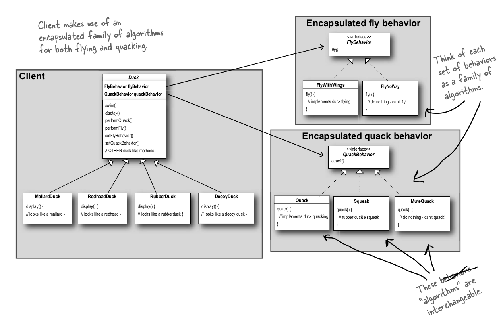

## 策略模式

不同鸭子的 fly 和 quack 的方式不一样，有些可以飞，有些不可以，有些可以叫，有些不可以。应该将这些变化的部分抽象出来，不要和那些不需要变化的代码混在一起。

Duck类有4个方法：

swim()：每个实例都有相同的swim方法。故实现放在虚基类Duck里；

display()：每个实例都有不同的该方法，它必须是纯虚函数，由每个子类单独实现

两个算法族，flying 和 quacking。由于每个子类的flying和quacking的行为（算法）可能相同也可能不同，这是变化的部分，这里将其抽象出来，在构造每个子类的时候单独去设置。

